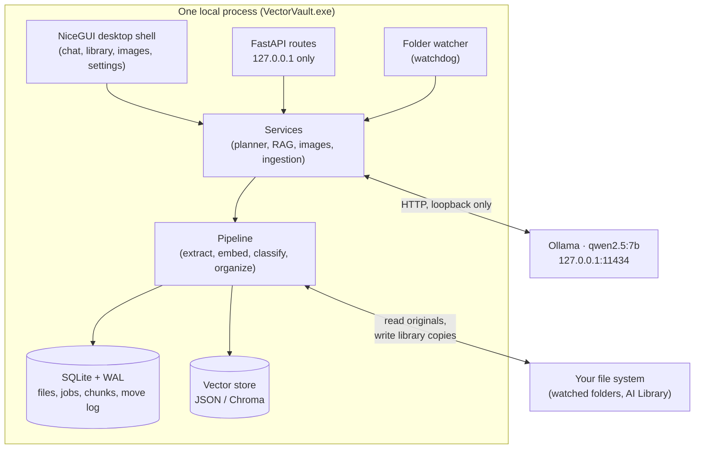

# Architecture

One process holds everything: the UI, the HTTP API, the folder watcher, the processing
pipeline, and the tray icon. There is no server, no account, no cloud component at all —
the "backend" is a local port on 127.0.0.1.

A longer, design-history version of this document lives in
[docs/architecture.md](docs/architecture.md); this is the submission summary.

## System diagram

## Model pipeline

Three models, one rule between them: **retrieval decides, the LLM only writes.**

| Stage | Model | What it does |
|---|---|---|
| Text embedding | `BAAI/bge-small-en-v1.5` (384-d) | Every document chunk and every question becomes a vector; asymmetric query prefix on the question side |
| Image embedding | `clip-ViT-B-32` (512-d) | Photos and photo *descriptions* land in one shared vector space |
| Generation | `qwen2.5:7b` via Ollama (Q4_K_M) | Phrases answers from retrieved passages; writes filing plans as schema-constrained JSON |

## Data flow

**Filing:** file appears (dropped or watched) → debounce + stability check → hash (BLAKE2b,
dedupe key) → extract text (PyMuPDF / pdfplumber / python-docx / python-pptx) → chunk →
embed → classify against the curriculum knowledge base → confidence gate → either auto-file
or the review queue. Bulk organize adds the LLM: it receives the classified summaries and
emits a *plan* (destinations + reasons, as JSON constrained by a schema) that the user
approves before the organizer executes it.

**Asking:** question → embed → retrieve top chunks → drop everything below the measured
relevance floor (0.55) → if nothing survives, refuse without calling the model → otherwise
prompt qwen2.5 with numbered sources → answer with file + page citations.

**Photos:** folder → CLIP embeds each image once (hash-keyed, idempotent) → a description
is embedded into the same space → cosine ranking, floor 0.20.

## Local vs. cloud

| Component | Where |
|---|---|
| LLM, embeddings, CLIP, OCR (planned) | On device |
| Database, vectors, logs, settings | On device (`%LOCALAPPDATA%\osdc`) |
| Filed documents | On device (`~/AI Library`) |
| Anything else | There is nothing else. One-time model downloads (Hugging Face, Ollama) are the only network traffic the app ever generates. |

## Key design decisions

1. **The LLM emits data, never commands.** Filing plans are JSON validated against a schema
   and executed by a deterministic organizer that logs every move *before* making it. The
   model cannot invent an `rm`, mangle a quoted filename, or escape the library root —
   there is a test that proves a hallucinated path cannot escape
   ([tests/test_planner.py](tests/test_planner.py)).
2. **Grounded or silent.** If retrieval clears nothing above the relevance floor, the LLM is
   never invoked ([tests/test_rag.py](tests/test_rag.py)). The floors themselves were
   measured, not guessed (`scripts/calibrate.py`).
3. **Ports and one composition root.** Every swappable piece (extractor, embedder,
   classifier, vector store, LLM client, queue) is a `Protocol` in
   [domain/ports.py](src/osdc/domain/ports.py); every concrete choice is made in
   [container.py](src/osdc/container.py). The app was built as a walking skeleton with fake
   AI first; enabling the real models changed three lines.
4. **Layering enforced in CI.** `ui/api → services → pipeline → domain`, checked by
   import-linter on every push, so the architecture cannot rot silently.
5. **Write-ahead move log.** Every file operation is journaled before it happens, which is
   what makes undo trustworthy — including refusing to undo a copy whose original has
   vanished, because that would delete the only remaining copy.
6. **Hardware-matched model selection.** First-run setup detects GPU/VRAM and recommends
   the largest model that actually fits; a model that spills to CPU "works" but answers in
   forty seconds, which reads as a broken product.
