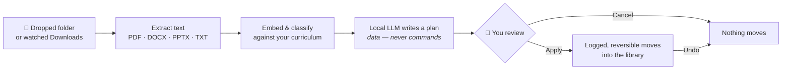
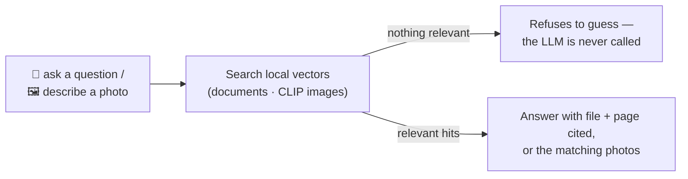

# 🗂️ Vector Vault


[](https://github.com/me-is-mukul/Vector-Valut/actions/workflows/ci.yml)

**Your documents, filed and findable. Your photos, searchable by describing them. Nothing ever leaves your machine.**

Vector Vault is a local-first desktop app: drop a messy folder into a chat, and it reads every file, proposes where each one belongs (with a reason), and files them — reversibly. Ask it anything about your documents and it answers with the file and page cited. Type *"a man lifting a baby"* and the photo appears.

The LLM, the embeddings, the image model — all run locally. The only network calls it ever makes are to download its own models, once.

---

## 🎥 Demo

> **[▶ Watch the 2-minute demo](ADD_VIDEO_LINK_HERE)** <!-- paste YouTube/Drive link -->

| Chat & organize | Plan review | Photo search |
|:---:|:---:|:---:|
| *screenshot* | *screenshot* | *screenshot* |

<!-- Drop images into docs/screenshots/ and replace the cells above:
      etc. -->

---

## ✨ What it does

- 📂 **Drop a folder into the chat** — it reads every file, builds a knowledge base from the *contents* (not filenames), and proposes where each one should go. Nothing moves until you click Apply, and every move can be undone.
- 💬 **Ask your documents anything** — answers cite the exact file and page. If your library doesn't cover it, it says so instead of making something up.
- 🖼️ **Find photos by describing them** — no tags, no filenames; it looks at the pictures. iPhone HEIC included.
- 🌙 **Works while you're not looking** — lives in the system tray, watches your Downloads folder, and files new documents as they arrive.

## 🧭 How it works





## 🔒 The rules it will not break

1. **The model never touches your files.** It emits a *plan* — data, not shell commands. It cannot invent an `rm`, cannot mangle a filename with a quote in it, cannot escape the library folder. ([proof](tests/test_planner.py))
2. **The chatbot cannot answer from its own head.** If retrieval finds nothing relevant, the model is *never even called*. Your library holds medical records and bank statements; an assistant that invents their contents is worse than none. ([proof](tests/test_rag.py))
3. **Everything is reversible.** Every move is logged *before* it happens; colliding names get a `(1)` suffix; undo of a copy refuses to destroy the only remaining copy.

## 🎯 Use cases

- **The semester folder** — 200 PDFs named `lecture_final_v2 (3).pdf` sorted into subjects by what's *in* them, not what they're called.
- **Downloads chaos** — invoices, tickets, and statements file themselves as they arrive, even with the window closed.
- **"Where did I read that?"** — ask in plain English, get the answer with the page number to check it yourself.
- **Ten years of photos** — *"sunset on a beach"*, *"screenshot of an error message"* — found without a single tag.
- **Private records** — everything above works on medical and financial documents precisely *because* nothing is uploaded anywhere.

---

## 📦 Install

**Windows installer:** grab **[VectorVault-0.1.2-win64.msi](https://github.com/me-is-mukul/Vector-Valut/releases/download/v0.1.2/VectorVault-0.1.2-win64.msi)** from [Releases](https://github.com/me-is-mukul/Vector-Valut/releases).

On first run it detects your GPU and RAM, recommends a language model that *actually fits* (a model too big for VRAM silently spills to CPU and every answer takes forty seconds), installs [Ollama](https://ollama.com), and downloads the weights with a progress bar. After that, it's fully offline.

**From source:**

```bash
uv sync --extra vector --extra docs --extra ml --extra rag --extra desktop
uv run osdc
```

> ⚠️ A bare `uv sync` removes the extras again — always pass them.

**Cutting a release:** bump the version in `pyproject.toml` + `build_msi.py`, update `RELEASE_NOTES.md`, then push a tag. CI builds the MSI, **boots the actual frozen exe** to prove it starts, and publishes the release with the SHA256 attached.

```bash
git tag v0.1.3 && git push origin v0.1.3
```

## 🎓 Make it know *your* course

The academic classifier ships with a **made-up sample B.Tech CSE syllabus**. Replace [`src/osdc/data/curriculum.yaml`](src/osdc/data/curriculum.yaml) with yours:

```yaml
current_semester: 5
semesters:
  - number: 5
    subjects:
      - name: Operating Systems
        code: CS301
        description: >
          Processes and threads, CPU scheduling, semaphores, deadlock,
          paging, TLB, virtual memory, thrashing...
        topics: [paging, deadlock, semaphore, tlb, thrashing, page fault]
```

Write `description` and `topics` in the vocabulary a real document would use — "paging, TLB, page faults" beats "students will learn memory management". The knowledge base rebuilds itself on the next start. Classification thresholds were **measured, not guessed** (`uv run python scripts/calibrate.py`) — the first guess would have filed an article about Arctic terns under Data Structures.

## 🏗️ Architecture

```
ui/  api/     →  may import services/
services/     →  may import pipeline/, storage/
pipeline/     →  may import domain/
domain/       →  imports nothing of ours
```

Enforced in CI by [`.importlinter`](.importlinter), so it cannot rot. Everything swappable is a `Protocol` in [`domain/ports.py`](src/osdc/domain/ports.py); every concrete choice is made in exactly one file, [`container.py`](src/osdc/container.py). The app was built as a walking skeleton with fake AI first — turning on the real models changed three lines.

More: [planning](docs/planning.md) · [architecture](docs/architecture.md) · [roadmap](docs/roadmap.md)

## 🛠️ Development

```bash
uv run pytest            # 132 tests, including simulated-UI navigation tests
uv run ruff check .      # lint
uv run ruff format .     # format (CI checks this!)
uv run mypy              # types
uv run lint-imports      # the layering contract
```

**Under the hood:** Ollama (qwen2.5, hardware-matched) · bge-small embeddings · CLIP image search · pillow-heif HEIC decoding · SQLite + write-ahead move log · NiceGUI + pywebview desktop shell.

## 📄 License

[MIT](LICENSE) © 2026 Mukul and Dhvani
