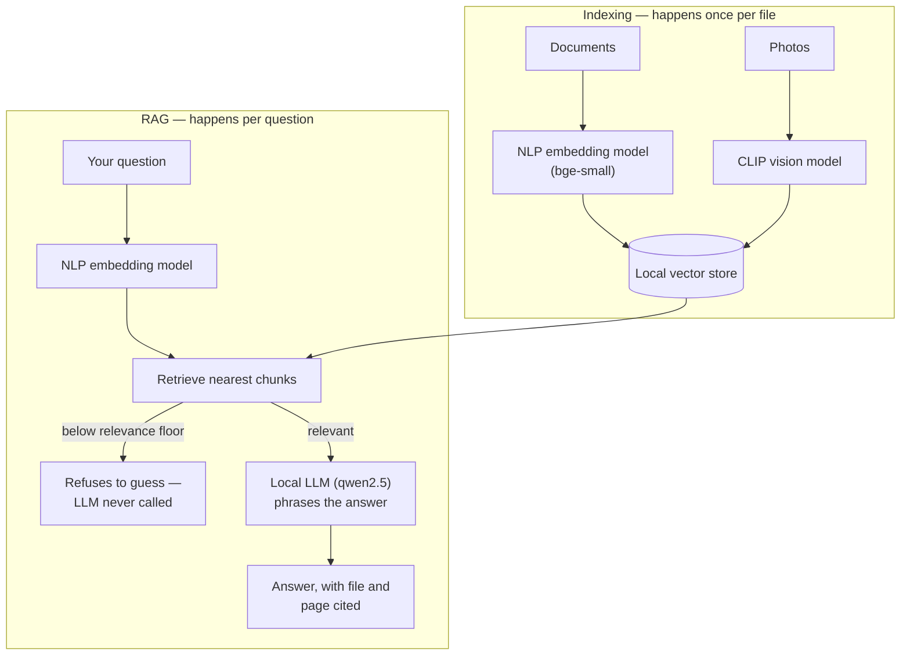
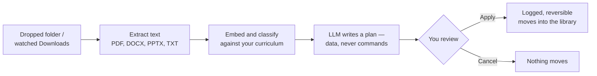

# Vector Vault


[](https://github.com/me-is-mukul/Vector-Valut/actions/workflows/ci.yml)

## Install
**The documentation is deployed online btw**
[docs-online-for-this-application-msi-installer](https://vault.doc.meismukul.in)

**Windows installer:**
[VectorVault-0.1.2-win64.msi](https://github.com/me-is-mukul/Vector-Valut/releases/download/v0.1.2/VectorVault-0.1.2-win64.msi)
(from [Releases](https://github.com/me-is-mukul/Vector-Valut/releases))

On first run it detects your hardware, recommends a language model that will actually fit in
your GPU, installs [Ollama](https://ollama.com), and downloads the weights with a progress
bar. That recommendation matters more than it sounds: pick a model too big for the VRAM and
Ollama silently spills half of it onto the CPU, so the app "works" but every answer takes
forty seconds and you conclude the product is slow. After setup, it is fully offline.

**From source:**

```bash
uv sync --extra vector --extra docs --extra ml --extra rag --extra desktop
uv run osdc
```

A bare `uv sync` removes the extras again — always pass them.


A local-first desktop app that reads your documents, files them where they belong, and lets
you find anything by describing it — including photos.

**Nothing leaves your machine.** The language model, the embeddings and the image model all
run locally. The app makes no network calls except to download its own models, once.

## The AI inside

Three kinds of model, with one rule between them: **retrieval decides, the LLM only writes.**

- **NLP (natural-language processing / embeddings)** — `bge-small` turns every chunk of
  every document into a vector, so "where is my rent contract" finds the contract even
  though no file is named that. **CLIP** does the same for photos: images and text land in
  one shared vector space, which is why *"a man lifting a baby"* finds the picture with no
  tags.
- **RAG (retrieval-augmented generation)** — the discipline that keeps the chatbot honest.
  Your question is embedded, the nearest document chunks are retrieved, and anything below a
  measured relevance floor is thrown away. Only what survives is handed to the LLM.
- **LLM (qwen2.5, via Ollama)** — does exactly two jobs: phrases answers *from the retrieved
  passages only*, and writes filing plans as structured data. If retrieval finds nothing, it
  is never called; it cannot run commands, ever.



## Demo

[Watch the demo](ADD_VIDEO_LINK_HERE) <!-- paste the video link here -->

<!-- Screenshots: drop images into docs/screenshots/ and uncomment.


-->

## What it does

**Drop a folder into the chat.** It reads every file, builds a knowledge base from the
contents — not the filenames — and proposes where each one should go, with a reason for
each. Nothing moves until you say Apply, and everything can be undone.

**Ask it anything about your documents.** Answers come with the file and the exact page
cited. If nothing in your library is relevant, it says so instead of making something up.

**Find a photo by describing it.** Type *"a man lifting a baby"* and the photos appear. No
tagging, no filenames — it looks at the pictures. iPhone HEIC included.

**It keeps working when you close the window.** It lives in the system tray, watches your
Downloads folder, and files new documents as they arrive. Quit properly from the tray icon.

## How it works

Filing is a pipeline with a human in the middle:



## The rules it will not break

**The model never touches your files.** When it decides how to organize a folder, it emits a
*plan* — data, not shell commands. It cannot invent an `rm`, cannot mangle a filename with a
quote in it, and cannot escape the library folder. You see the whole plan before a single
byte moves, and it goes through an engine that logs every move before making it.
([`test_a_hallucinated_path_cannot_escape_the_library`](tests/test_planner.py))

**The chatbot cannot answer from its own head.** If retrieval finds nothing relevant, the
model is *never even called*. Ask it who won the 1987 Formula One championship and it will
refuse, though it certainly knows. Your library holds medical records and bank statements;
an assistant that invents their contents is worse than none.
([`test_the_llm_is_never_called_when_nothing_is_relevant`](tests/test_rag.py))

**Nothing is overwritten, and everything is reversible.** Colliding names get a `(1)`
suffix. Undo of a copy refuses to run if the original has gone missing, because deleting the
library copy would then destroy the only copy.

## Where it earns its keep

- A semester folder of two hundred PDFs named `lecture_final_v2 (3).pdf`, sorted by what is
  *in* them rather than what they are called.
- A Downloads folder where invoices, tickets and statements file themselves as they arrive,
  window closed.
- "Where did I read that?" — asked in plain English, answered with a page number you can
  check.
- Ten years of photos, found by describing what is visible in them.
- All of it on medical and financial records, precisely because nothing is uploaded
  anywhere.

## Sample inputs and expected outputs

Everything goes through the chat box.

| You type (or click) | What happens |
|---|---|
| `organize C:\Users\you\Downloads` | It reads every file, then shows a plan: each file, its destination folder, and the reason. Nothing moves until you click **Apply**; **Undo** appears after. |
| `organize my downloads folder` | Same — bare folder names resolve against your home directory. |
| `what does my rent agreement say about the notice period?` | A cited answer: the clause, then a **Sources** list with the file name and page number. Click a source to reveal the file in Explorer. |
| `who won the 1987 F1 championship?` | *"I couldn't find anything in your library about that."* — nothing relevant is in your documents, so the model is never called. |
| The picture button → pick a photo folder | *"Looked at 132 photos."* with live progress while it works. |
| `find photos of a man lifting a baby` | A grid of matching photos with similarity scores; click one to open its location. |
| A new PDF lands in a watched folder | Filed automatically within seconds (or queued for review if confidence is low) — window closed, tray icon running. |

## Submission documents

| Document | Contents |
|---|---|
| [ARCHITECTURE.md](ARCHITECTURE.md) | System diagram, model pipeline, data flow, local/cloud split, key decisions |
| [TECHNICAL_REPORT.md](TECHNICAL_REPORT.md) | Models, quantization, measured latency and memory, tested device, local-AI verification |
| [EVALUATION.md](EVALUATION.md) | How it was measured, results, baseline comparison, known failure cases |
| [PRIVACY.md](PRIVACY.md) | Data handling, permissions, safety mechanisms, residual risks |
| [ATTRIBUTION.md](ATTRIBUTION.md) | Pretrained models, libraries, licenses |

**Releasing:** bump the version in `pyproject.toml` and `build_msi.py`, update
`RELEASE_NOTES.md`, then push a tag:

```bash
git tag v0.1.3 && git push origin v0.1.3
```

CI builds the MSI on a clean runner, boots the actual frozen exe to prove it starts, and
publishes the release with the checksum attached. An installer that cannot boot cannot ship.

## Make it know *your* course

The academic classifier is only as good as its Subject Knowledge Base, and the one that
ships is a generic sample B.Tech CSE syllabus. Replace it with yours:

**[`src/osdc/data/curriculum.yaml`](src/osdc/data/curriculum.yaml)**

```yaml
current_semester: 5
semesters:
  - number: 5
    subjects:
      - name: Operating Systems
        code: CS301
        description: >
          Processes and threads, CPU scheduling, semaphores, deadlock, paging,
          page tables, TLB, virtual memory, page replacement, thrashing...
        topics: [paging, deadlock, semaphore, tlb, thrashing, page fault]
```

`description` and `topics` are what get embedded, so write them in the vocabulary a real
document about that subject would use. "Paging, segmentation, TLB, page faults" beats
"students will learn about memory management." Edit the file and the knowledge base rebuilds
itself on the next start.

## Thresholds were measured, not guessed

```bash
uv run python scripts/calibrate.py
```

Sentence embeddings have a high baseline — two *unrelated* texts still score ~0.4–0.55. The
first guess at the similarity floors (0.45 / 0.40) would have filed an article about Arctic
terns under Data Structures (0.549) and an invoice under Programming Fundamentals (0.463).
The measured floors are **0.62** and **0.53**, with clean separation. Re-run the script
whenever you change the curriculum.

## Architecture

```
ui/  api/     →  may import services/
services/     →  may import pipeline/, storage/
pipeline/     →  may import domain/
domain/       →  imports nothing of ours
```

Enforced in CI by [`.importlinter`](.importlinter), so it cannot rot.

Everything swappable is a `Protocol` in [`domain/ports.py`](src/osdc/domain/ports.py), and
every concrete choice is made in exactly one file, [`container.py`](src/osdc/container.py).
The app was built as a walking skeleton with fake AI first; turning on the real models
changed three lines there and nothing else.

- [docs/planning.md](docs/planning.md) — scope and decisions
- [docs/architecture.md](docs/architecture.md) — diagrams, pipelines, data model
- [docs/roadmap.md](docs/roadmap.md) — what's built, what's next

## Development

```bash
uv run pytest            # 132 tests, including simulated-UI navigation tests
uv run ruff check .
uv run ruff format .     # CI checks formatting too
uv run mypy
uv run lint-imports      # the layering contract
```

Under the hood: Ollama (qwen2.5, hardware-matched) · bge-small embeddings · CLIP image
search · pillow-heif HEIC decoding · SQLite with a write-ahead move log · NiceGUI and
pywebview for the desktop shell.

## License

[MIT](LICENSE) © 2026 Mukul and Dhvani
