# Architecture — AI-Powered Intelligent Document & Image Management System

> **Companion doc:** [planning.md](planning.md) (scope, decisions, roadmap)
> **Diagrams:** Mermaid (renders on GitHub, VS Code with a Mermaid extension, and most Markdown viewers).
> **Last updated:** 2026-07-10

---

## Table of Contents
1. [Guiding Principles](#1-guiding-principles)
2. [High-Level System Architecture](#2-high-level-system-architecture)
3. [Component Architecture](#3-component-architecture)
4. [Ingestion & File-Monitoring Flow](#4-ingestion--file-monitoring-flow)
5. [Document Processing Pipeline](#5-document-processing-pipeline)
6. [Classification Decision Flow (semester-aware + confidence)](#6-classification-decision-flow)
7. [Image Processing Pipeline](#7-image-processing-pipeline)
8. [RAG Chatbot Flow](#8-rag-chatbot-flow)
9. [Unified Search Flow](#9-unified-search-flow)
10. [Review & Learning Loop](#10-review--learning-loop)
11. [Data Model](#11-data-model)
12. [Vector Store Layout](#12-vector-store-layout)
13. [Deployment & Packaging](#13-deployment--packaging)
14. [Tech-to-Component Map](#14-tech-to-component-map)

---

## 1. Guiding Principles

- **Local-first & offline by default** — personal, identity, and medical documents never leave the machine.
- **Content over filenames** — every routing/search decision is driven by extracted text and visual embeddings.
- **One Python process** — NiceGUI (UI) and FastAPI (API + pipelines) share a single app; no JS toolchain, no separate frontend server.
- **UI-agnostic core** — pipelines, storage, and models know nothing about the UI, so the UI can be swapped (NiceGUI → Flet) without touching them.
- **Reversible & conservative** — prefer the Review Queue over a wrong auto-move; log originals for undo.
- **Same code, two delivery modes** — native desktop (PyInstaller) and hosted web (Docker).

---

## 2. High-Level System Architecture

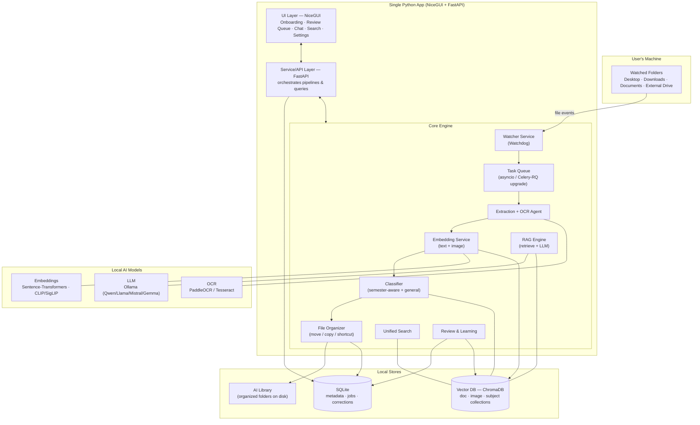

---

## 3. Component Architecture

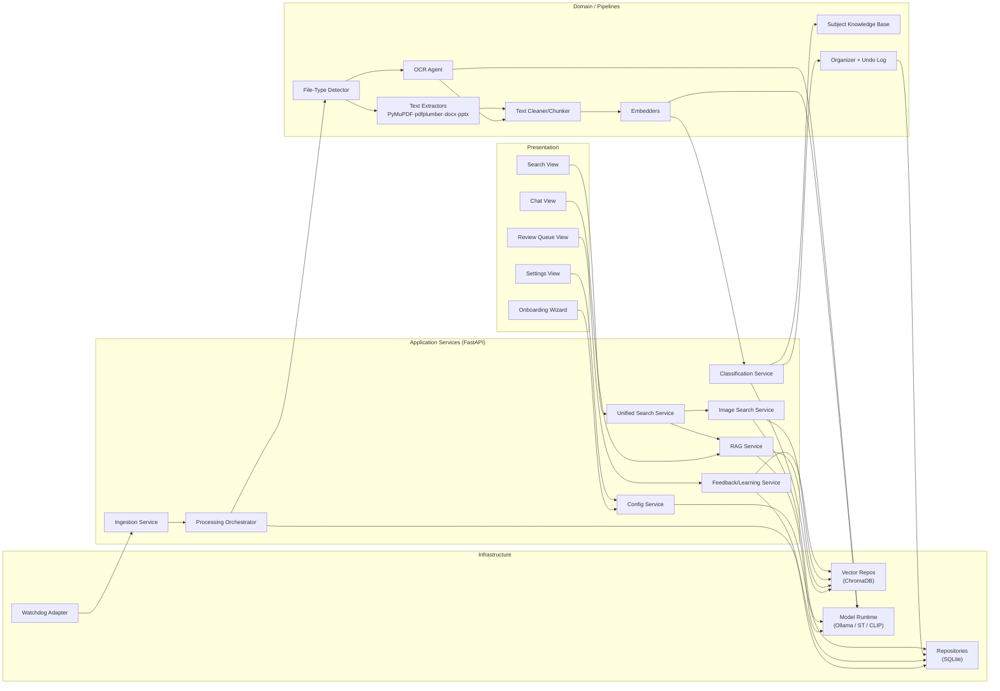

---

## 4. Ingestion & File-Monitoring Flow

Handles bulk downloads, partial/temp files, and duplicates before anything hits the expensive pipeline.

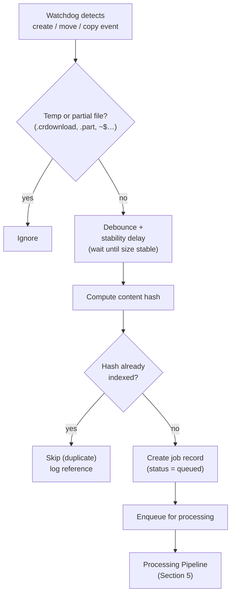

---

## 5. Document Processing Pipeline

The core Feature-2 pipeline, including the OCR-agent decision.

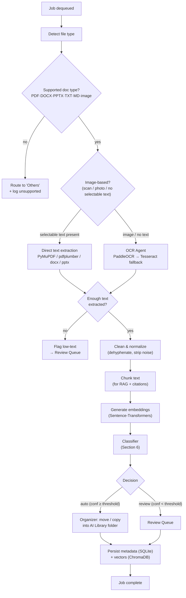

---

## 6. Classification Decision Flow

Semester-first academic matching, then general fallback, then the confidence gate.

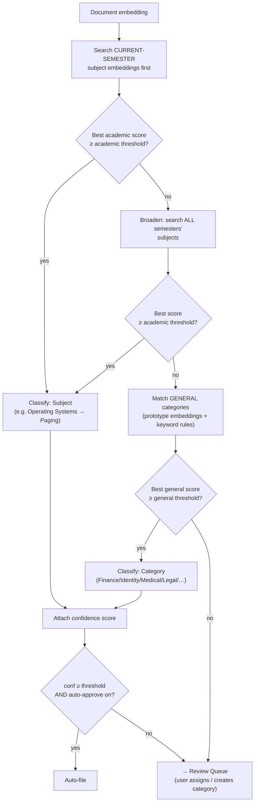

**Worked example (from spec):** `Operating Systems 0.94 · Computer Networks 0.71 · AI 0.39` with threshold `0.85` → auto-file to **Operating Systems**.

---

## 7. Image Processing Pipeline

Every image gets a **visual** embedding; text-heavy images *also* get an OCR-text embedding — enabling both "sunset on the beach" and "screenshot containing segmentation fault".

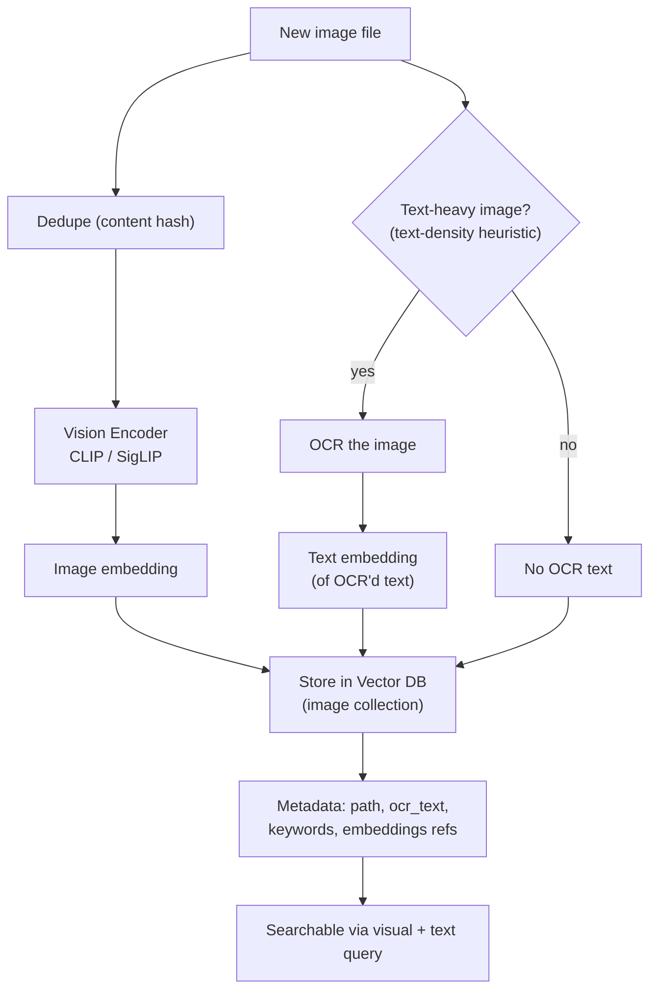

---

## 8. RAG Chatbot Flow

Answers over the document collection, **with citations to file + page/section**.

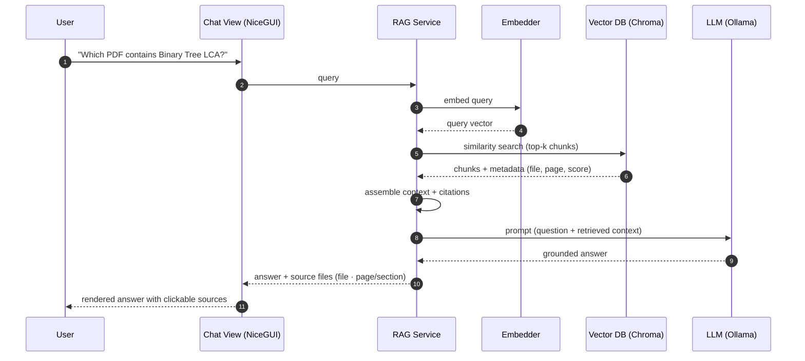

---

## 9. Unified Search Flow

A single query fans out across document and image collections, then merges results.

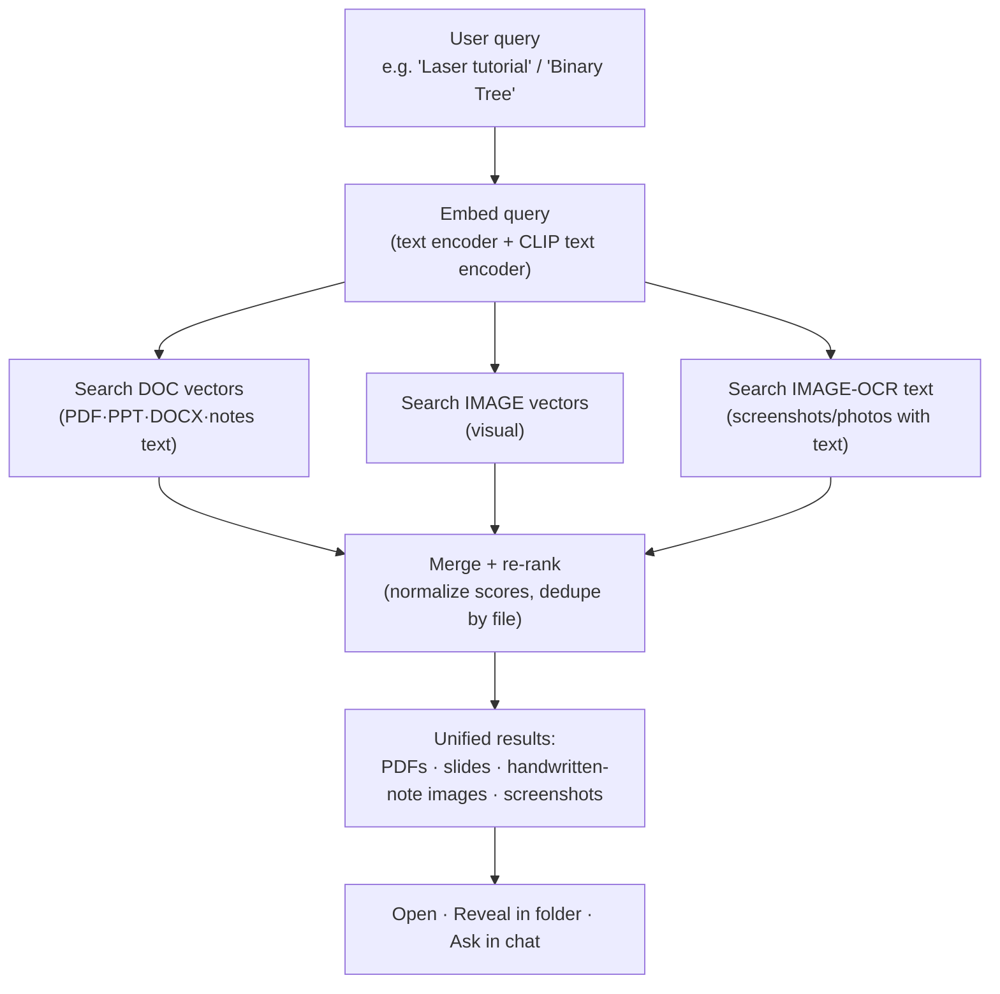

---

## 10. Review & Learning Loop

Low-confidence items and user corrections feed back into future routing.

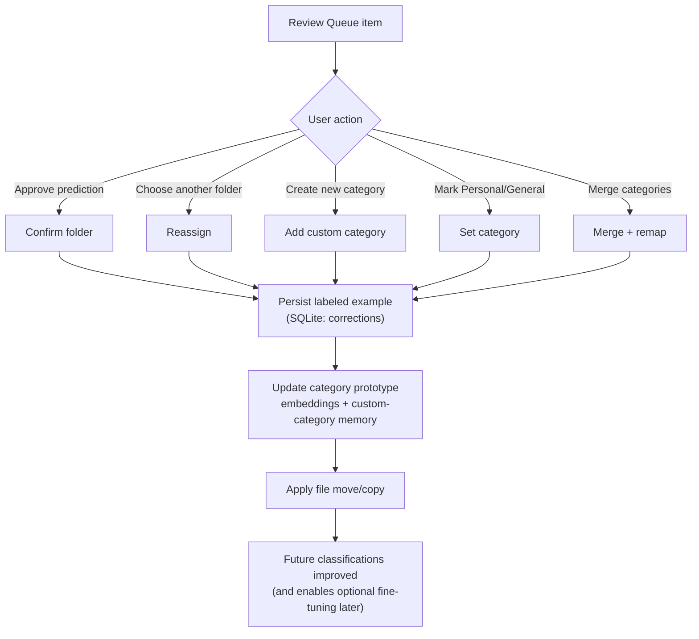

---

## 11. Data Model

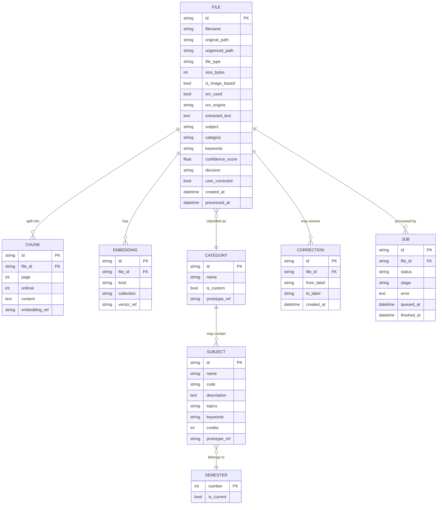

---

## 12. Vector Store Layout

ChromaDB collections (embedded, persisted locally):

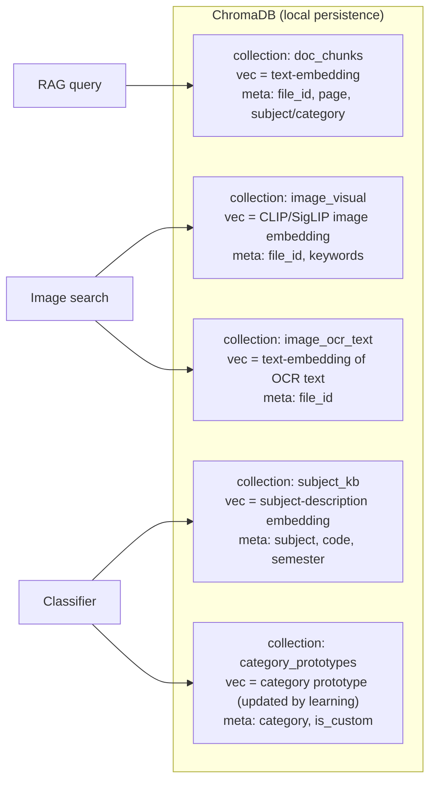

> **Scale-up path:** the same collection contracts map onto **Qdrant** for the deployable/server mode; a **FAISS** flat/IVF index is an option if pure-vector speed at scale is needed.

---

## 13. Deployment & Packaging

One codebase, two targets.

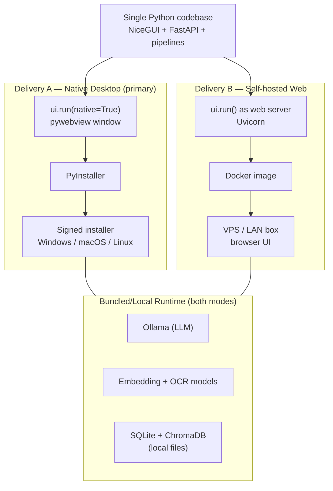

**Notes**
- **Desktop mode** is fully offline; no ports exposed to the network.
- **Web mode** should sit behind auth/reverse-proxy; surface a clear "hosted" indicator since documents may be sensitive.
- Models are either bundled in the installer or fetched once during onboarding (see planning.md open questions).

---

## 14. Tech-to-Component Map

| Component | Technology |
|-----------|-----------|
| UI (desktop + web) | **NiceGUI** (`native=True` / web) |
| API & orchestration | **FastAPI** + **Uvicorn** |
| Background jobs | `asyncio` in-process → **Celery/RQ + Redis** (scale) |
| File monitoring | **Watchdog** |
| Type detection | `filetype` / `mimetypes` / magic bytes |
| Text extraction | **PyMuPDF**, **pdfplumber**, **python-docx**, **python-pptx**, **Unstructured** |
| OCR | **PaddleOCR** (primary), **Tesseract** (fallback), EasyOCR (optional) |
| Text embeddings | **Sentence-Transformers** (`bge-*` / MiniLM / e5) |
| Image embeddings | **CLIP / SigLIP** (`open_clip`) |
| LLM (RAG) | **Ollama** (Qwen / Llama / Mistral / Gemma) |
| RAG orchestration | **LlamaIndex** (or LangChain) |
| Vector DB | **ChromaDB** (default) · **Qdrant** / FAISS (scale) |
| Metadata DB | **SQLite** (default) · PostgreSQL (deploy option) |
| Config / schemas | **Pydantic** / Pydantic Settings |
| Packaging | **PyInstaller** (desktop) · **Docker** (web) |

---

### Cross-references
- Scope, feature table, roadmap, risks → [planning.md](planning.md)
- Classification strategy detail → [planning.md §8](planning.md#8-classification-strategy-finalized)
- Data fields → [planning.md §7](planning.md#7-data-model-finalized-fields)
